# OBlog

#### 介绍
Oblog，基于Spring Boot + MyBatis + Spring Security实现的精简博客系统，前端UI框架为Layui，使用的数据库为MySQL。

密码在数据库中使用密文存储，登陆时前后端传输的也是密码的密文，一定程度上增加了用户账户的安全性。

响应式设计，支持电脑、手机排版显示。

> gitee：https://gitee.com/weingxing/oblog

> github：https://github.com/weingxing/OBlog


##### 开发环境

- IntelliJ IDEA
- Java 8
- Lombok
- MySQL 5.6

> 开发时使用了Lombok，项目导入IDEA时，如果没有安装Lombok插件，会有红色波浪线错误提示
>
> 使用Lombok虽然代码更简洁，但增加了代码耦合，可读性也变差了，但无奈本人太懒 o(￣┰￣*)ゞ


#### 演示地址
> http://oblog.mapletown.xyz (服务器性能有限，打开速度可能较慢）
>
> 管理员账号：admin，密码：123456
>
> 普通账号：test，密码：123456
>
> **请不要修改密码**


#### To-Do

- [x] 数据库设计
- [x] DAO层
- [x] Service层、Controller层
- [x] 日志打印
- [x] 统一异常处理
- [x] 用户注册和用户权限管理
- [x] 文章管理
- [x] 评论管理
- [x] 用户投稿
- [ ] <del>使用机器学习判断垃圾评论 </del>  (未找到合适数据集)
- [x] 邮件通知
- [x] 文章代码内容高亮显示
- [x] LaTex渲染支持
- [ ] <del>MarkDown语法编辑文章</del> （对投稿用户可能不友好，替换为富文本编辑器）

#### 功能

1. 访客浏览文章
2. 响应式，自适应电脑、手机
3. 注册、登录
4. 文章评论
5. 注册用户投稿文章
6. 文章管理
7. 评论管理
8. 文章代码高亮显示
9. 文章时间轴
10. 文章分类
11. LaTex公式渲染
12. 收到新的评论、投稿时邮件通知博主
13. 后台管理播放网易云歌单


#### 部署说明

导入sql文件到数据库，修改配置文件中的端口号（如果需要），数据库地址、用户名和密码，使用maven将项目打成jar包，上传至服务器，运行jar文件。

```shell
nohup java -jar <jar file> 2>&1 &
```

默认管理员账户：admin，密码：123456


#### 运行截图

##### 首页

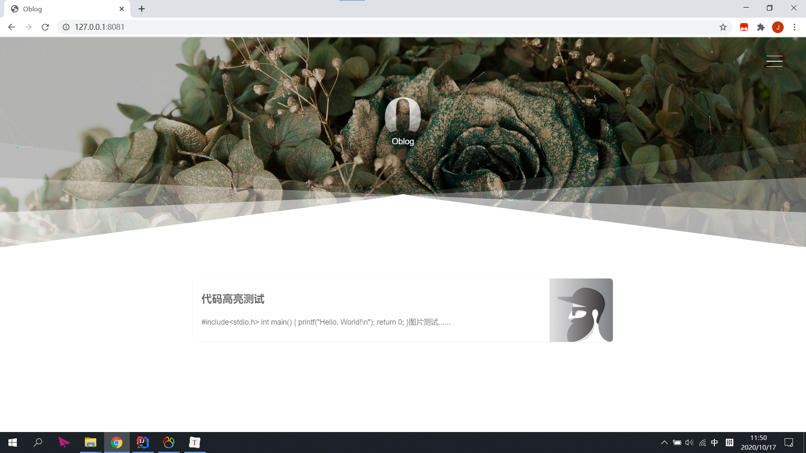


##### 文章查看页

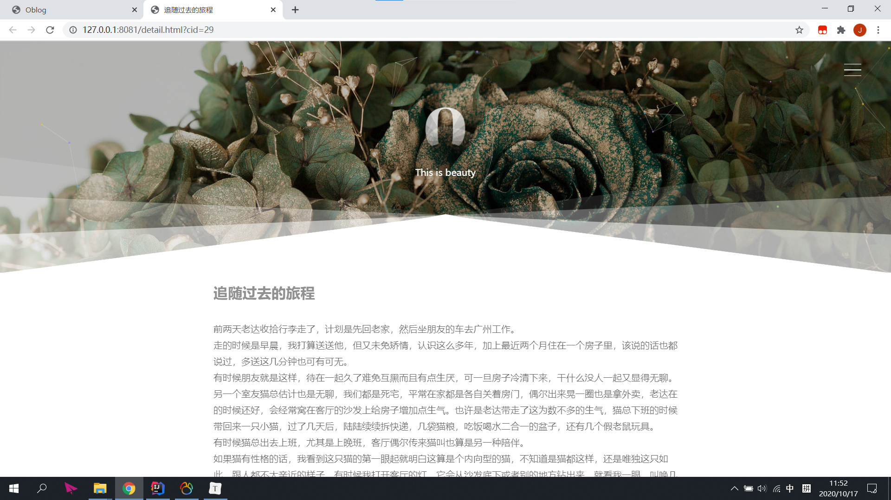


##### 代码高亮

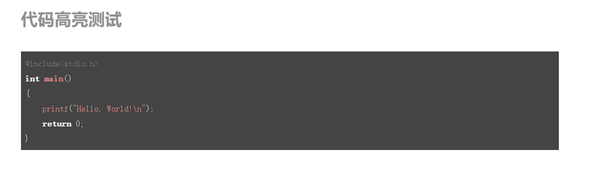

##### Latex渲染


##### 登录页

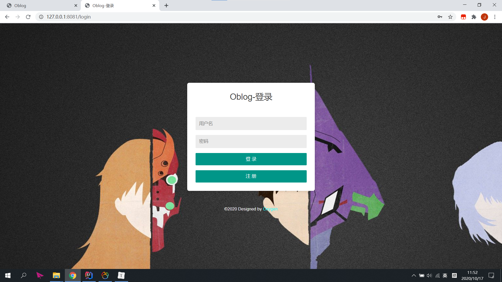


##### 注册页

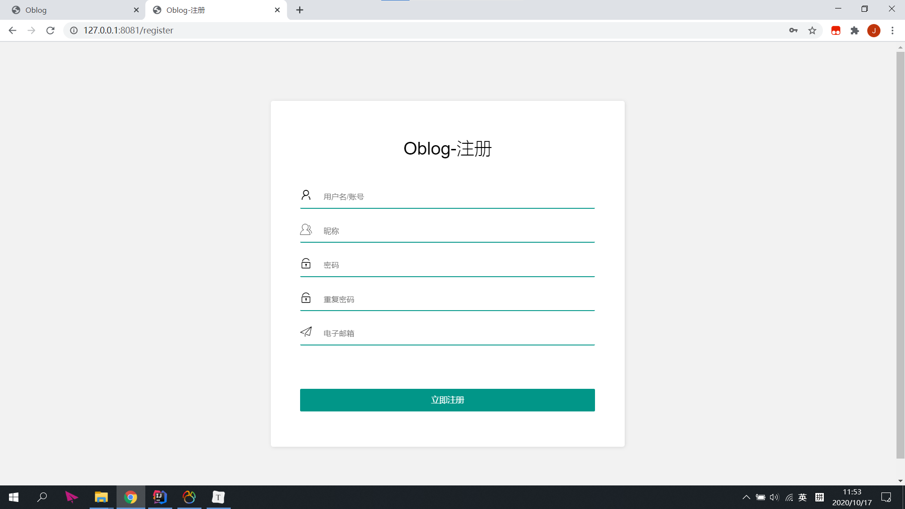


##### 管理员后台

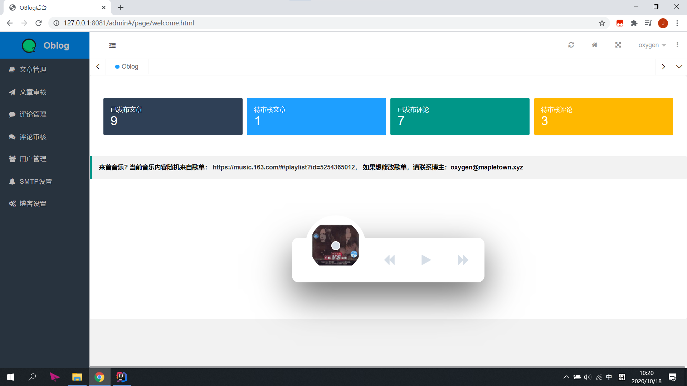


##### 用户后台

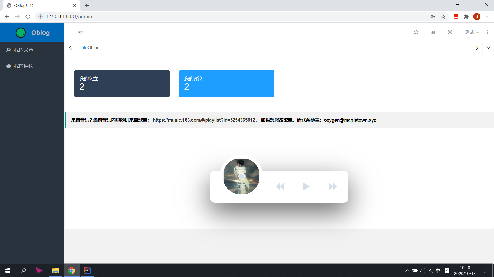


##### 手机端首页

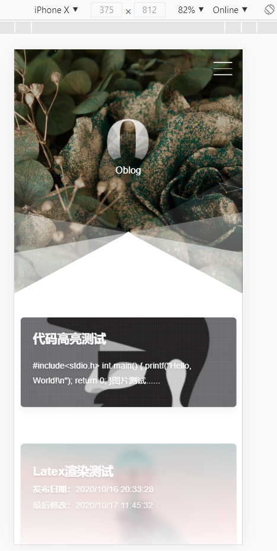


##### 手机端文章

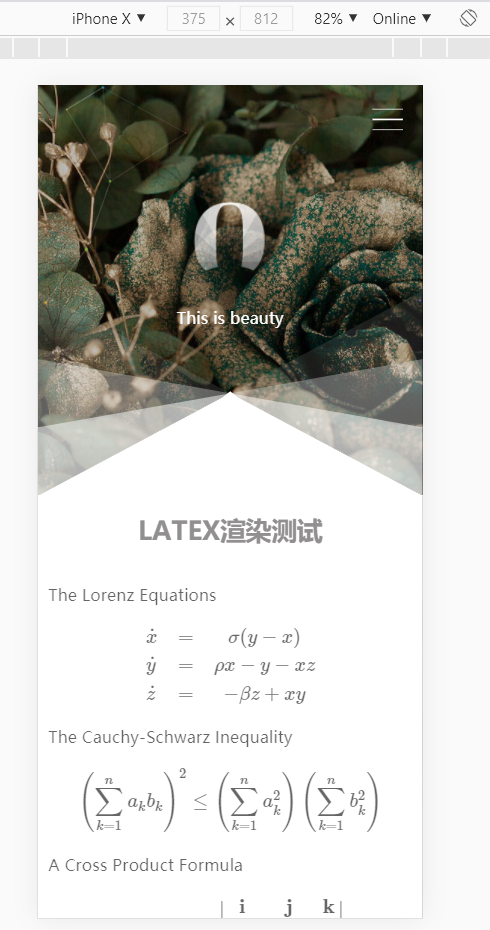


##### 手机端后台

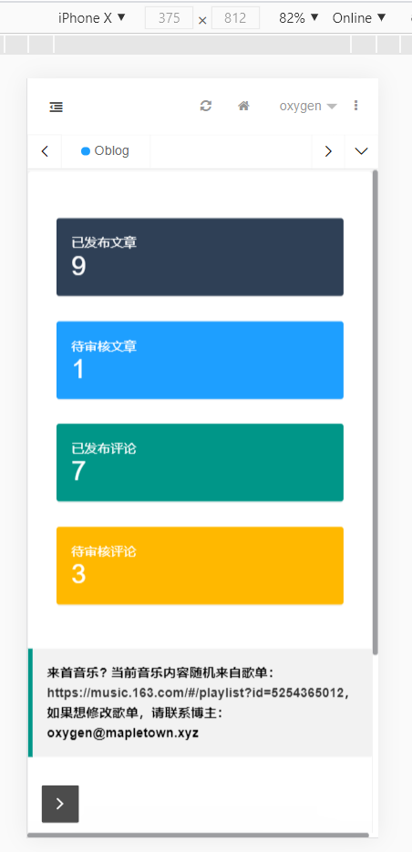


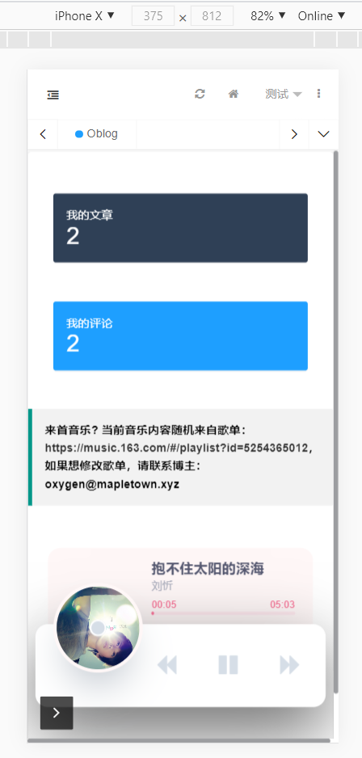